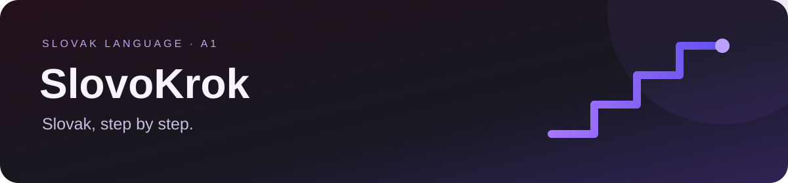
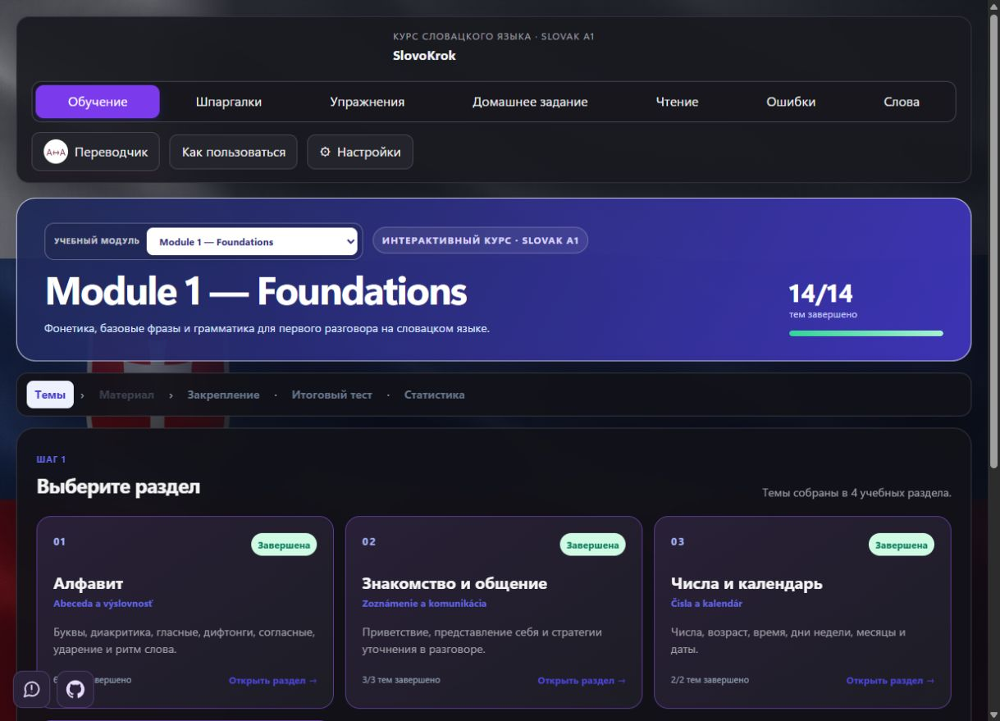
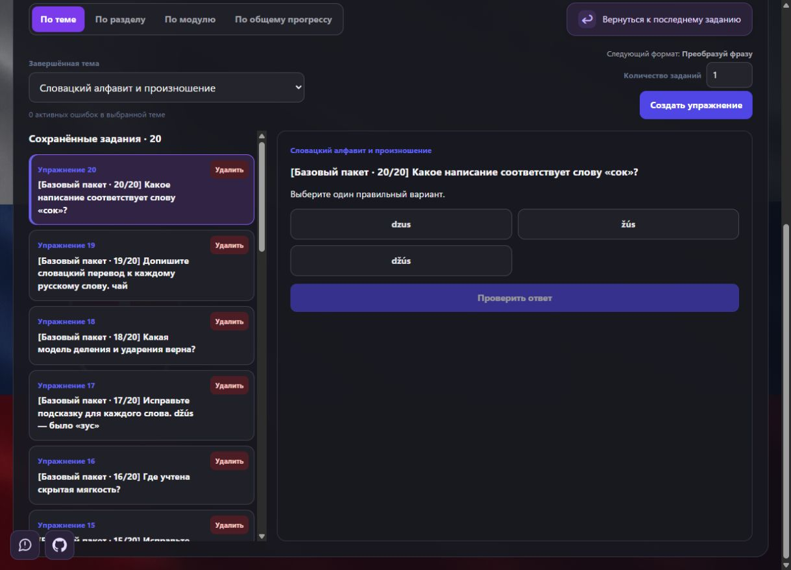
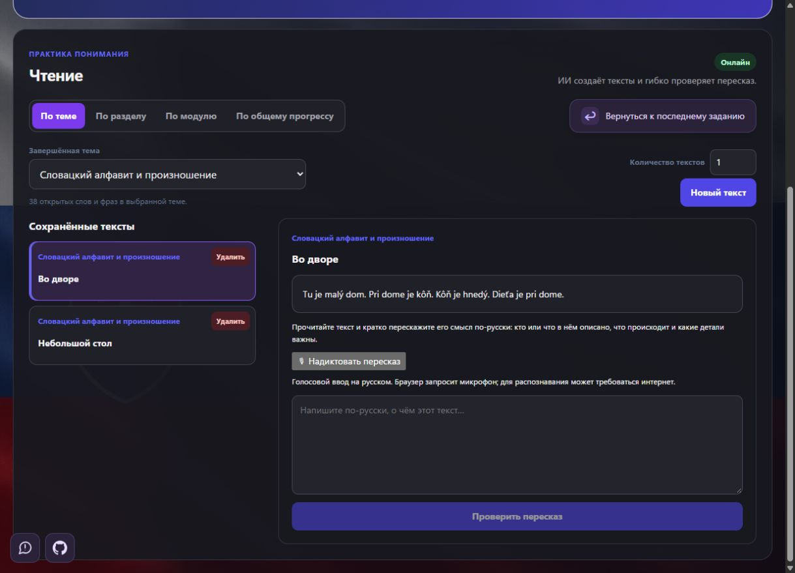
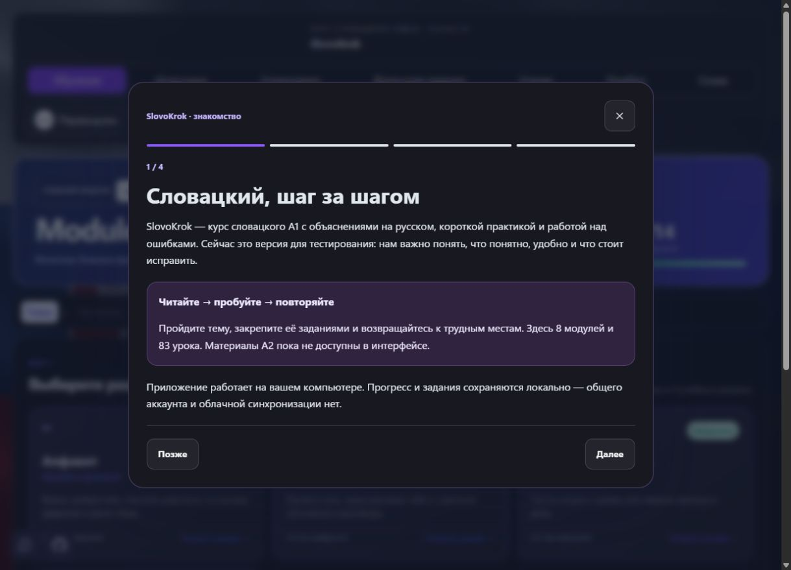
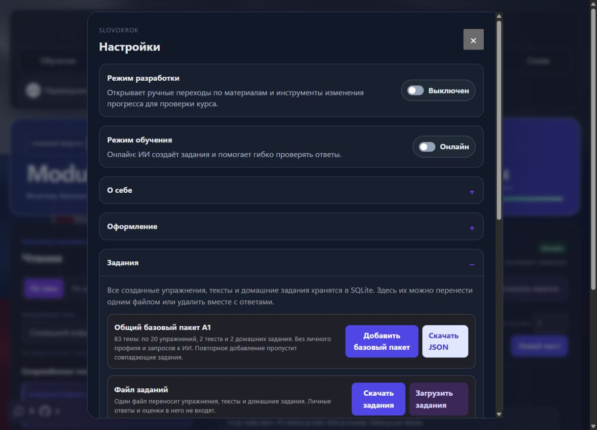

<p align="center"></p>

<h1 align="center">Slovak, step by step</h1>
<p align="center">83 topics · 8 modules · practice based on your progress</p>
<p align="center"><a href="README.md">Русский</a> · <strong>English</strong> · <a href="README.sk.md">Slovenčina</a></p>
<p align="center"><a href="https://github.com/Eobart96/SlovoKrok">GitHub</a> · <a href="TESTING_START.md">Tester guide</a> · <a href="UPDATES.md">Updates</a></p>

A local, single-user app for learning Slovak. The A1 course has 8 modules and
83 topics, with Russian explanations, practice, reading, homework, vocabulary
and mistake review. These translated READMEs do not change the app's language.



| A1 topics | Exercises | Reading texts | Homework tasks |
| :---: | :---: | :---: | :---: |
| **83** | **1660** | **166** | **166** |

Each topic includes 20 exercises, 2 reading texts and 2 homework tasks.

## Application screenshots

Dark theme. Captured using a separate demo database, without personal answers or profile data. Click a screenshot to view it at full size.

<table>
<tr>
<td width="50%" valign="top"><strong>Exercises and saved tasks</strong><br><br><a href="docs/screenshots/exercises.jpg"></a></td>
<td width="50%" valign="top"><strong>Reading and voice retelling</strong><br><br><a href="docs/screenshots/reading.jpg"></a></td>
</tr>
<tr>
<td width="50%" valign="top"><strong>Welcome guide</strong><br><br><a href="docs/screenshots/welcome.jpg"></a></td>
<td width="50%" valign="top"><strong>Basic task pack in settings</strong><br><br><a href="docs/screenshots/task-pack.jpg"></a></td>
</tr>
</table>

## Installation on Windows

You need **Python 3.12+**, **Node.js 22+** and an internet connection to install
dependencies. Enable Python's PATH option during installation. Git is optional.

1. Download and extract the repository ZIP, or clone it:

   ```powershell
   git clone https://github.com/Eobart96/SlovoKrok.git
   cd SlovoKrok
   ```

2. Open `install.cmd` in the project folder to install dependencies.
3. Open `start.cmd`. The browser opens at http://127.0.0.1:3000/.
4. Open **Настройки → Задания → Добавить базовый пакет** to add the basic tasks.

Use `doctor.cmd` for diagnostics and `stop.cmd` to stop the app.
The source ZIP is not a standalone installer. Windows is the documented
launcher platform; public server deployment is not supported.

## Basic task pack

Each of the 83 A1 topics includes **20 exercises, 2 reading texts and 2 homework
tasks**: 1660 exercises, 166 texts and 166 homework tasks in total.
The pack has no names, personal profile, learner answers or grades.
Tasks become available after completing the corresponding topic.
Adding the same pack again skips identical tasks and preserves progress.

[Download JSON](frontend/public/task-packs/slovokrok-a1-basic-v1.json) ·
[Pack sources and rebuild instructions](course-content/basic-task-pack/README.md).

## Added features

- Welcome walkthrough, available again from the help button.
- Saved section position and return to the last exercise, reading or homework.
- Local checking of exercises with exact references, including online mode.
- Record a mistake, review its explanation, practise and reinforce it.
- Dictate a reading retelling. Online AI assessment focuses on meaning and
  accounts for speech recognition mistakes and Slovak words in Russian speech.
  Speech recognition depends on the browser and internet connection.
- Optional learner profile to adapt examples; theme and text size settings.
- Bug reports with screen context, screen capture, ZIP export and list clearing.
- Tasks-only JSON transfer, task management and course backups.
- 72 A2 study PDFs; the interactive A2 pilot is not enabled in the UI.

Navigation: learning → cheat sheets → exercises → homework → reading → mistakes
→ words. The interface and teaching explanations are currently in Russian.

## AI and personal data

Lessons and the basic pack work without an AI provider. Exact-reference tasks
are checked locally. Offline assessment of open answers is approximate.
Meaning-based assessment and new task generation require your own Codex CLI
or an OpenAI-compatible provider; API usage may cost money.
Choose a provider in the app settings. `.env` is optional; see `.env.example`.
The optional profile is shared with AI only with permission.

On Windows, user data is stored in `%LOCALAPPDATA%\SlovoKrok`, outside the
repository. The source contains no author's database, API keys or progress.
A new source folder on the same computer uses the existing data directory.
For another computer, use the app's backup; tasks-only export excludes answers
and grades. There is no account system or cloud sync.

## Updating

1. Export a backup in settings and stop the app with `stop.cmd`.
2. For a Git checkout, run `git pull --ff-only` in the project folder.
   Save your own code changes first; do not force-reset them.
   For ZIP installations, extract the new source into a new folder.
3. Run `install.cmd` again, then `start.cmd`.
4. Add the basic pack if needed; identical tasks are skipped.

## Project structure and status

`frontend/`: Next.js, React, TypeScript and course content.
`backend/`: FastAPI, SQLAlchemy, SQLite and AI integration.
`course-content/`: teaching material and editable pack sources.
`output/pdf/A2/`: A2 PDFs. `scripts/`: launchers and validators.
`.github/`: CI and feedback templates. `docs/`: technical documentation.

This is a testing version. Modules 7–8 still await full manual acceptance.
Clean-computer installation and manual acceptance of the current UI have not
been confirmed. Authentication, multi-user operation and public deployment
are outside the current scope.

[Tester guide (Russian)](TESTING_START.md) · [Updates](UPDATES.md) ·
[Architecture](docs/ARCHITECTURE.md) · [API](docs/API.md) ·
[Data](docs/DATABASE.md) · [Checks](docs/TESTING.md) · [Security](SECURITY.md).

## License

[MIT](LICENSE).
